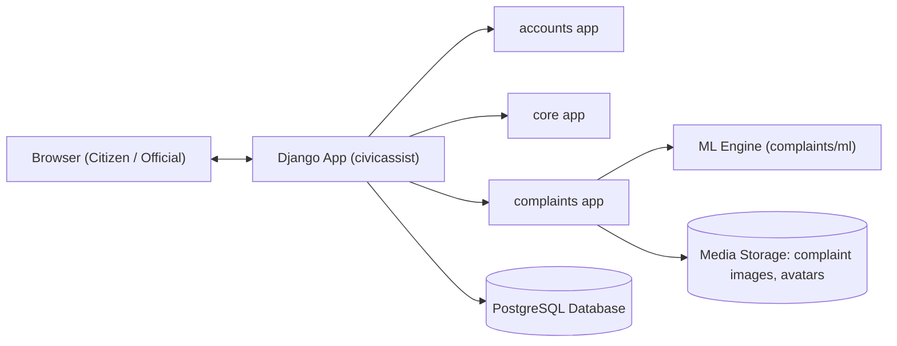
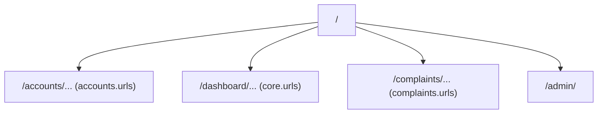

## CivicAssist – System Documentation

### 1. Introduction

CivicAssist is a citizen grievance management system built with **Django 5** and **PostgreSQL**.  
It supports:

- Citizen portal to file and track complaints.
- Official portal to manage department grievances.
- ML‑based routing engine that auto‑selects department and priority.
- Full complaint history and SLA‑based auto‑escalation.

---

### 2. High‑Level Architecture

#### 2.1 Component Diagram



---

### 3. Django Project Structure

- `manage.py` – Django CLI entry point.
- `civicassist/`
  - `settings.py` – settings; PostgreSQL config; installed apps.
  - `urls.py` – top‑level URL routing.
- `accounts/`
  - `models.py` – `User`, `Citizen`, `Official`.
  - `views.py` – login & signup.
  - `urls.py` – `/accounts/...` routes.
- `core/`
  - `views.py` – dashboards & profile pages.
  - `urls.py` – `/dashboard/...` routes.
- `complaints/`
  - `models.py` – `Department`, `Complaint`, `Notification`, `ComplaintHistory`.
  - `views.py` – complaint lifecycle (file, detail, close, transfer, escalate, reopen).
  - `urls.py` – `/complaints/...` routes.
  - `ml/`
    - `classifier.py` – ML model lifecycle & prediction.
    - `generate_training_csv.py` – synthetic data generator (100k rows).
    - `artifacts/` – training CSV + saved `.joblib` models.
- `templates/`
  - `base.html`, `index.html`, `login.html`, `signup.html`, etc.
  - Citizen views: `citizendashboard.html`, `file_complaint.html`, `citizen_history.html`, …
  - Official views: `officialdashboard.html`, `official_history.html`, …
  - Shared: `complaint_detail.html`, `citizen_notifications.html`, …

---

### 4. URL and View Routing

#### 4.1 Top‑Level URL configuration

- `/` → `home`
- `/accounts/` → `accounts.urls`
- `/dashboard/` → `core.urls`
- `/complaints/` → `complaints.urls`
- `/admin/` → Django admin



---

### 5. Data Model Overview

Key entities:

- `User` (custom auth user)
- `Citizen` / `Official` profile models
- `Department`
- `Complaint` (ticket_number, status, priority, location, etc.)
- `Notification`
- `ComplaintHistory` (immutable audit events)

Relationships:

- A `User` (citizen) files many `Complaint`s.
- Each `Complaint` belongs to a `Department`.
- `Official` is bound to one `Department`.
- `Complaint` has many `Notification` and `ComplaintHistory` entries.

---

### 6. Complaint Lifecycle Workflows

#### 6.1 Filing a complaint (Citizen)

1. Citizen opens `/complaints/file/` → `file_complaint.html` form.
2. Submits description, location, optional image.
3. View calls `predict_department_and_priority(description)` from `complaints/ml/classifier.py`.
4. System:
   - Chooses matching `Department` by `code` (or Helpline fallback).
   - Creates `Complaint`:
     - `ticket_number` auto‑generated based on original department code.
     - `status = OPEN`.
   - Creates initial `ComplaintHistory` with action `FILED`.
5. Citizen is redirected back to their dashboard.

#### 6.2 Status changes and escalation

Implemented in `complaints/views.py`:

- **Close complaint (Official)**:
  - `status` → `CLOSED`.
  - `Notification` to citizen.
  - `ComplaintHistory` (`CLOSED`).
- **Citizen escalate to Helpline**:
  - Department → Helpline.
  - `status` → `TRANSFERRED`.
  - History records `ESCALATED_TO_HELPLINE`.
- **Official transfer (wrong department)**:
  - Department → new department.
  - `status` → `TRANSFERRED`.
  - History records `TRANSFERRED`.
- **Citizen reopen**:
  - `status` → `REOPENED`.
  - History records `REOPENED`.
- **Auto‑escalation (SLA)**:
  - On dashboard visits, old complaints auto‑move to Helpline.
  - History records `AUTO_ESCALATED`.

---

### 7. ML Model Architecture

Located in `complaints/ml/classifier.py`.

- Uses:
  - `TfidfVectorizer` + `MultinomialNB` (Scikit‑learn).
  - `ComplaintPrediction` dataclass (department_code, priority).
- Training data:
  - Primary: `complaints/ml/artifacts/complaints_training_data.csv` (100k synthetic rows).
  - Fallback: small built‑in seed dataset.

#### 7.1 Model lifecycle

1. Check if saved models exist:
   - `department_pipeline.joblib`
   - `priority_pipeline.joblib`
2. If yes → load and reuse (no retrain).
3. If no:
   - Try to load CSV.
   - Train department and priority pipelines.
   - Save `.joblib` to disk.

Public API:

- `predict_department_and_priority(text: str) -> ComplaintPrediction`
  - Returns `department_code` and `priority`.
  - Falls back to `HELP` + `MEDIUM` if anything fails.

---

### 8. Synthetic Training Data Generator

`complaints/ml/generate_training_csv.py`:

- Generates `complaints_training_data.csv` with **100,000** rows.
- Each row:
  - `text` – synthetic complaint text per department.
  - `department_code` – e.g., `MC-PWD`, `DIST-HEALTH`.
  - `priority` – `LOW`, `MEDIUM`, `HIGH`, `CRITICAL`.
- Uses templates plus random areas/landmarks and random prefixes/suffixes.

Command to regenerate:

```bash
python complaints/ml/generate_training_csv.py
```

---

### 9. Running and Retraining

#### 9.1 Run the project

```bash
python manage.py makemigrations
python manage.py migrate
python manage.py runserver
```

#### 9.2 Force ML retrain

1. Delete existing `.joblib` models (optional).
2. Ensure CSV exists.
3. Restart the server and file a complaint once; models will retrain automatically.

---

### 10. Ready for Future FastAPI Integration

Because the ML code is pure Python and separated from Django:

- A FastAPI service can import:

```python
from complaints.ml.classifier import predict_department_and_priority
```

- And expose a `/predict` endpoint that simply forwards text and returns the predicted department and priority.

